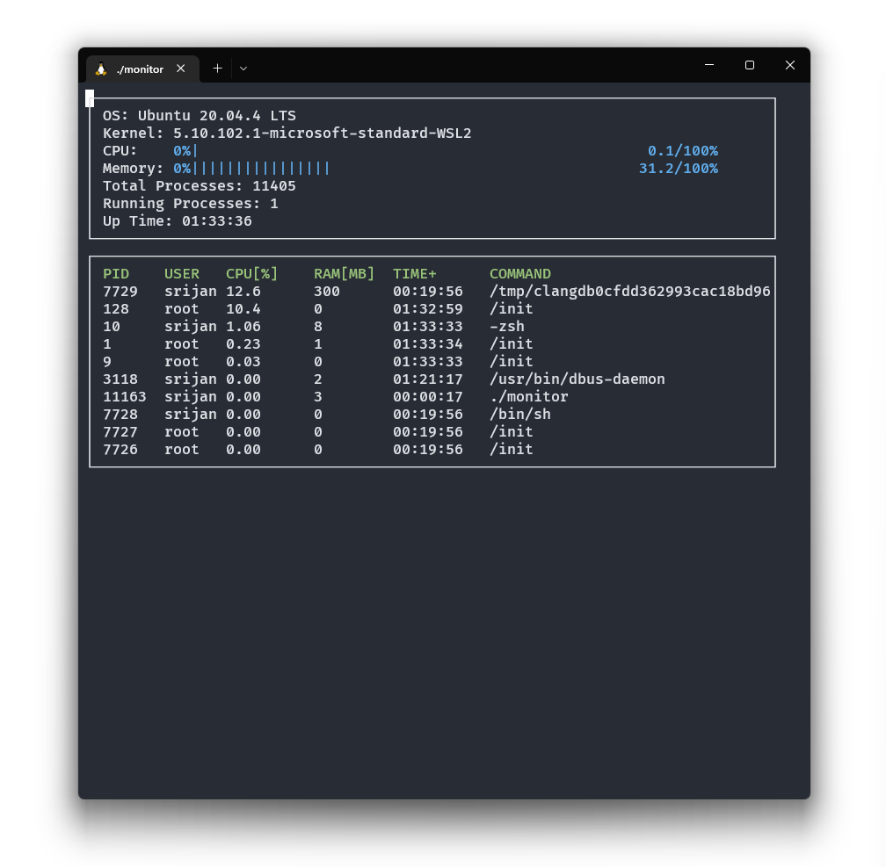

# System Monitor

System monitor implementation based on the starter code found in this
[repository from Udacity](https://github.com/udacity/CppND-System-Monitor).



## Running the project

1. Clone the project repository
   ```bash
   git clone https://github.com/srijan-nayak/CppND-System-Monitor
   ```

2. Build and run
   ```bash
   make build
   build/monitor
   ```
   